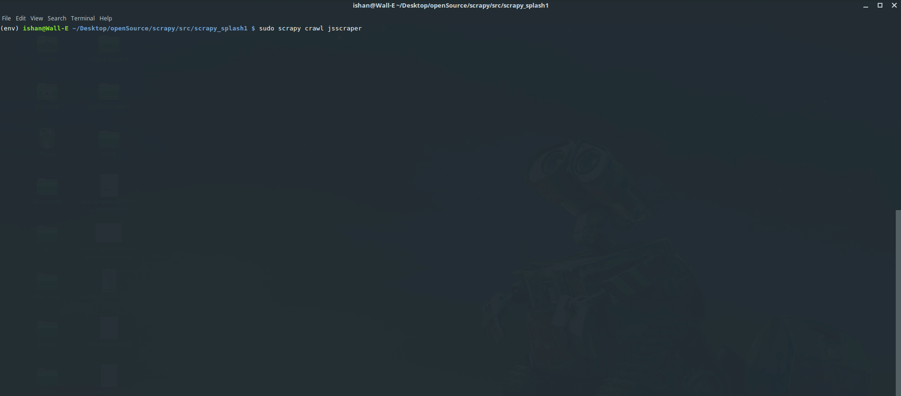
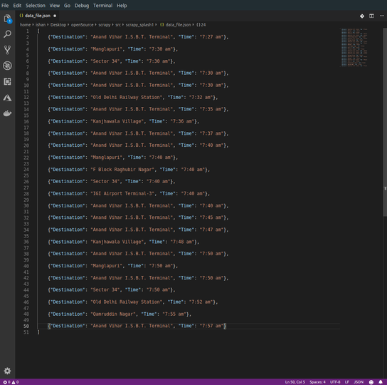

# A web scraper to extract bus schedule information from google maps


---
## Steps
---

### Pull the docker image

```Shell
sudo docker pull scrapinghub/splash
```

---

### Run the docker image

```Shell
sudo docker run -it -p 8050:8050 scrapinghub/splash
```

---

### Create a virtual environment

Use python2

Use following to find the path to python2

```Shell
which python2
```

for my machine the path is `/usr/bin/python2/`

```Shell
virtualenv --python=/usr/bin/python2 env
source env/activate
```

---

### Install the dependencies

```Shell
pip install -r requirements.txt
```

---

### Run scrapy

```Shell
cd scrapy_splash1
sudo scrapy crawl jsscraper
```



The data is saved in `data_file.json` file in the same directory

